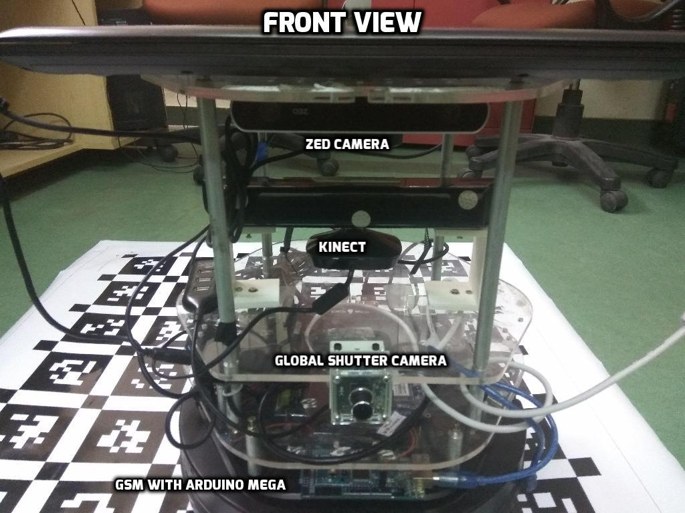
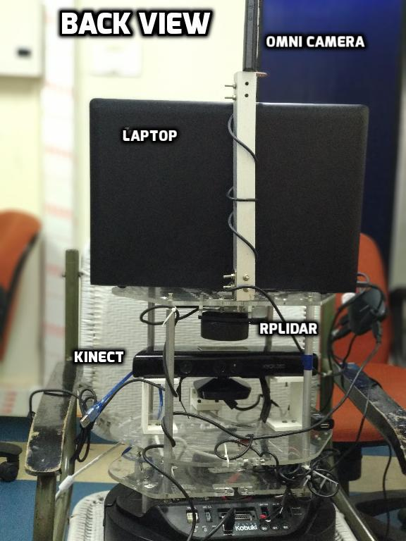

# MuSe-Dataset
## Overview

The objective of this project was to develop a dataset repository with sensors and provide it to the robotics community on which various algorithms can be tested and verified. The dataset presently collected and discussed in the report comprises of data collected from a single robot system for calibration and verificaton purposes.

The datasets being collected comprises of a setup of various sensors
which are discussed in the upcoming chapters. The whole repository
will be made available to the public in the upcoming days with the
resources we used and developed during the calibration procedure and
verification. The end users can either use our calibration parameters or
can apply their own algorithms to find the same. Datasets provided will
be in the form of ROSBAGS which is the standard way of recording the
data in the ROS environment. The bags would contain all messages
received from sensors and with their intrinsic and extrinsic
parameters.

All  the  sensors  have  been  mounted on top of a  mobile robot iClebo Kobuki  platform.  
The data collected includes the data from the following sensors:
1. ZED Camera
2. Kinect 
3. Global Shutter Camera
4. LIDAR
5. Odometry
6. Omni Camera

<p align="center">
	
  
  
</p>

## Calibration of LIDAR and Odometry
We have used [__Andrea Censi__](https://censi.science/) 's  ```csm``` and ```calibration``` packages to perform calibration of the LIDAR and Odometry parameters. The present project an RPLIDAR A1 development kit by robot peak  which contains the RPLIDAR (2D Laser Scanner). 
### Instructions for performing calibration:
1. Install the ```csm``` and ```calibration``` packages mentioned above.
2. Clone the repository and replace ```calibration/matlab_calibration_script/test_c1.bag``` with your bag file containing LIDAR and Odometry data.
3. Make sure that you build the package ```calibration/matlab_calibration_script/calibration-master```.
4. Run the script ```calibration/matlab_calibration_script/automate_LIDAR_odom.py``` to get the desired calibration results.

## Extract backend from Google Cartographer
1. Install [__Cartographer__](https://google-cartographer-ros.readthedocs.io/en/latest/) and make sure that it runs on the data for which the data is to be extracted.
2. Replace ```catkin_ws/src/cartographer_ros/cartographer_ros/map_builder_bridge.cc``` in Cartographer with ```cartographer/map_builder_bridge.cc``` provided in this repository. Run Cartographer for your data with the aforementioned changes.
3. You will get a file ```info.txt```. Place it in the same directory as ```extract-backend.py``` provided in this directory and execute this Python script.
4. A new file ```isam_reordered.txt``` will be created which contains the required backend data.
